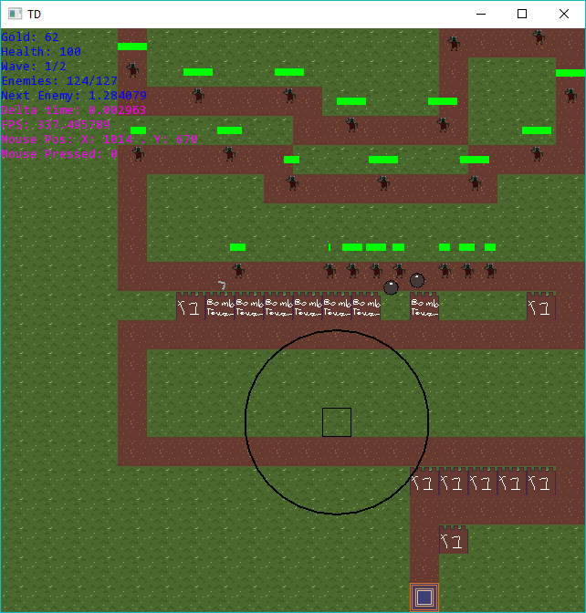

# Tower Defense
2D TD game in C++ with the SFML library.

## TODO

* ~~Tower cost~~
* ~~Base getting destroyed~~
* Game End state (Win\Lose\Retry)
* ~~Waves (Loaded from file etc)~~
* ~~Everything should use node~~
* Projectiles

### Code Standards

Argument in class methods should just be the name, use this-> to differentiate between them. E.g `this->health = health`.